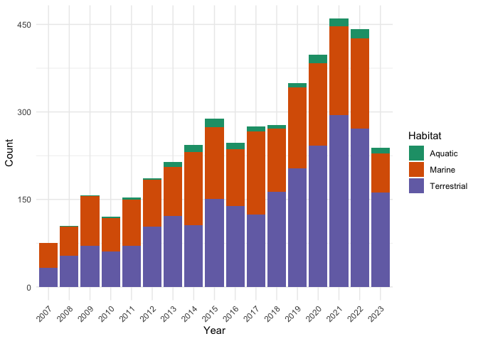
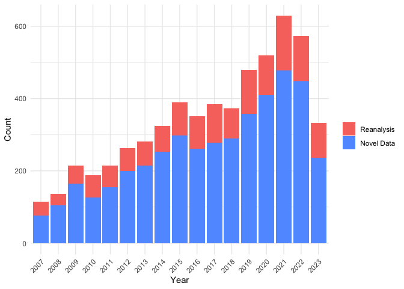
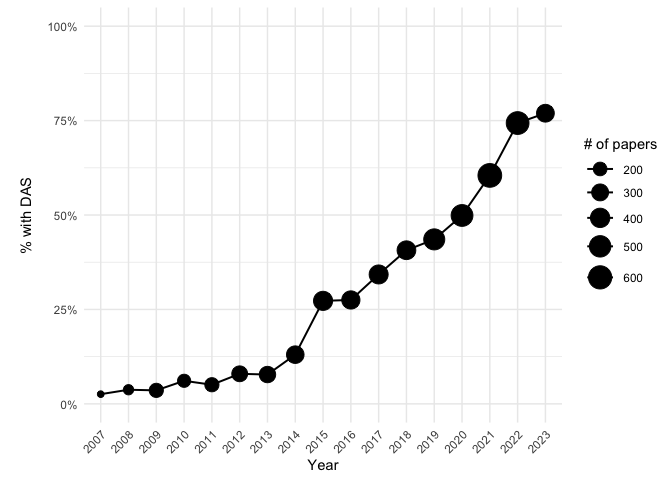

<!-- README.md is generated from README.Rmd. Please edit that file -->

# openbiologging 

<!-- badges: start -->

<!-- badges: end -->

**openbiologging** provides data from a systematic literature review
assessing open data practices in biologging research. Biologging — the
use of miniaturized animal-attached sensors to record movement,
behavior, physiology, and environment — has grown rapidly as a field,
yet how openly researchers share the resulting data remains poorly
characterized.

This package contains two datasets:

- **`biologging`** — 4,799 papers scored by at least two reviewers on
  manuscript type, biologging context, sensor categories, focal species,
  and data availability.
- **`taxa`** — taxonomic records (genus, species, habitat) for all
  species tagged in multi-species studies.

The underlying review queried Web of Science Core Collection on
2023-08-21 across twelve ecological and biological subject categories.
Full methods are available at
<https://flukeandfeather.github.io/openbiologging/methods.html>.

## Installation

You can install the development version of openbiologging from
[GitHub](https://github.com/haylee360/openbiologging) with:

``` r
# install.packages("pak")
pak::pak("haylee360/openbiologging")
```

## Datasets

### `biologging`

One row per reviewed paper. Key columns:

| Column | Description |
|----|----|
| `manuscript_type` | S (Study), R (Review), M (Method), P (Perspective), D (Data paper) |
| `novel_biologging` | Y/N — were new biologging data collected? |
| `biologging_context` | W (Wild), C (Captive), D (Domesticated), or combinations |
| `external_data` | Y/N — did the paper rely on externally shared non-biologging data? |
| `device_cat` | L (Location), I (Intrinsic), E (Environment), or combinations |
| `habitat` | A (Aquatic), M (Marine), T (Terrestrial), or combinations |
| `biologging_availability` | Y/N — does the paper have a biologging-specific data availability statement? |
| `genus` / `species` | Focal taxon |

``` r
library(openbiologging)
library(dplyr)

glimpse(biologging)
#> Rows: 5,769
#> Columns: 26
#> $ assigned_to             <chr> "tjl", "tjl", "tjl", "tjl", "tjl", "tjl", "tjl…
#> $ id                      <chr> "mercker2021", "skarin2008", "mcgranahan2018",…
#> $ doi_link                <chr> "doi.org/10.1186/s40462-021-00260-y", "doi.org…
#> $ manuscript_type         <chr> "M", "S", "S", "S", "S", "S", "S", "S", "S", "…
#> $ novel_biologging        <lgl> FALSE, TRUE, TRUE, TRUE, TRUE, FALSE, TRUE, TR…
#> $ biologging_context      <chr> NA, "W", "D", "W", "D", "W", "C", "D", "W", "W…
#> $ external_data           <chr> "N", "N", "N", "N", "N", "Y", "Y", "N", "Y", "…
#> $ device_cat              <chr> NA, "L", "L", "L", "L", "L", "I", "I", "L", "L…
#> $ genus                   <chr> NA, "Rangifer", "Ovis", "Chelonia", "Bos", "Mi…
#> $ species                 <chr> NA, "tarandus", "aries", "mydas", "indicus", "…
#> $ habitat                 <chr> NA, "T", "T", "M", "T", "M", "M", "T", "MT", "…
#> $ more_species            <chr> "N", "N", "Y", "N", "Y", "Y", "N", "N", "N", "…
#> $ biologging_availability <chr> NA, "N", "N", "N", "N", "N", "N", "N", "N", "Y…
#> $ conserv                 <chr> "N", "N", "Y", "Y", "N", "N", "N", "N", "N", "…
#> $ note                    <chr> "Simulated habitat and tracking data, rather t…
#> $ authors                 <chr> "Mercker, M; Schwemmer, P; Peschko, V; Enners,…
#> $ title                   <chr> "Analysis of local habitat selection and large…
#> $ source                  <chr> "Movement Ecology", "Wildlife Biology", "Ecolo…
#> $ year                    <dbl> 2021, 2008, 2018, 2018, 2016, 2015, 2014, 2021…
#> $ volume                  <dbl> 9, 14, 8, 37, 6, 96, 3, 11, 375, 58, 11, 525, …
#> $ issue                   <dbl> 1, 1, 11, NA, NA, 2, 5, 8, NA, NA, 24, NA, NA,…
#> $ doi                     <chr> "10.1186/s40462-021-00260-y", "10.2981/0909-63…
#> $ pub_type                <chr> "J", "J", "J", "J", "J", "J", "J", "J", "J", "…
#> $ source_sheet            <chr> "tjl", "tjl", "tjl", "tjl", "tjl", "tjl", "tjl…
#> $ access                  <chr> NA, NA, NA, NA, NA, NA, NA, NA, NA, NA, NA, NA…
#> $ reviewed                <lgl> TRUE, TRUE, TRUE, TRUE, TRUE, TRUE, TRUE, TRUE…
```

### `taxa`

Taxonomic records for all species in multi-species studies
(`more_species == "Y"` in `biologging`). Join to `biologging` via the
`id` column.

``` r
glimpse(taxa)
#> Rows: 3,845
#> Columns: 3
#> $ id      <chr> "skarin2008", "mcgranahan2018", "naromaciel2018", "suzuki2014"…
#> $ genus   <chr> "Rangifer", "Ovis", "Chelonia", "Eumetopias", "Odobenus", "Bra…
#> $ species <chr> "tarandus", "aries", "mydas", "jubatus", "rosmarus", "leucopsi…
```

## Examples

### Habitat representation over time

``` r
library(ggplot2)

hab_data <- biologging |>
  filter(!is.na(year), !is.na(habitat), habitat %in% c("A", "M", "T")) |>
  count(year, habitat)

ggplot(hab_data,aes(x = factor(year), y = n, 
                    fill = habitat)) +
  geom_col() +
  scale_y_continuous(name = "Count", breaks = c(0, 150, 300, 450, 600)) +
  scale_fill_manual(
    values = c("A" = "#1b9e77", "M" = "#d95f02", "T" = "#7570b3"),
    labels = c("A" = "Aquatic", "M" = "Marine", "T" = "Terrestrial"),
    name = "Habitat"
  ) +
  labs(x = "Year", y = "Count") +
  theme_minimal() +
  theme(
    axis.text.x = element_text(angle = 45, hjust = 1),
    legend.box.margin = margin(t = 20)
  )
```



### Novel data analysis

``` r
# Count novel and reanalysis papers by year
novel_year <- biologging %>%
  group_by(year) %>%
  count(novel_biologging) %>%
  ungroup()

ggplot(novel_year, aes(x = factor(year), y = n, fill = novel_biologging)) +
  geom_col() +
  scale_fill_manual(
    values = c("TRUE" = "#619CFF", "FALSE" = "#F8766D"),
    labels = c("TRUE" = "Novel Data", "FALSE" = "Reanalysis"),
    name = ""
  ) +
  scale_x_discrete(name = "Year") +
  scale_y_continuous(name = "Count", breaks = c(0, 200, 400, 600)) +
  theme_minimal() +
  theme(
    axis.text.x = element_text(angle = 45, hjust = 1),
  )
```



### Percent with Data Availability Statements bubble chart

``` r
# Select data availability statement data
das_data <- biologging %>%
  filter(!is.na(year)) %>%
  group_by(year) %>%
  summarize(pct = mean(biologging_availability == "Y",
                       na.rm = TRUE),
            n = n(),
            .groups = "drop")

# Plot DAS bubble and line chart
ggplot(das_data,aes(x = factor(year), y = pct, 
                    size = n, group = 1)) +
  geom_line(linewidth = 0.7, colour = "black") +
  geom_point(colour = "black") +
  scale_y_continuous(
    labels = scales::percent_format(accuracy = 1),
    limits = c(0, 1)
    ) +
  scale_size_continuous(name = "# of papers", range = c(2, 8)) +
  labs(x = "Year", y = "% with DAS") +
  theme_minimal() +
  theme(
    axis.title.y = element_text(margin = margin(10, 10, 10, 10)),
    axis.text.x = element_text(angle = 45, hjust = 1)
  )
```



## Citation

If you use this dataset, please cite:

    To cite package 'openbiologging' in publications use:

      Czapanskiy M, Oyler H (2026). _Open Biologging Data_. R package
      version 0.1.0, <https://github.com/haylee360/openbiologging>.

    A BibTeX entry for LaTeX users is

      @Manual{dataset_key,
        title = {Open Biologging Data},
        author = {Max Czapanskiy and Haylee Oyler},
        year = {2026},
        note = {R package version 0.1.0},
        url = {https://github.com/haylee360/openbiologging},
      }

## Methods

Full review methods, including the Web of Science query, inclusion
criteria, and reviewer rubric, are available at:
<https://flukeandfeather.github.io/openbiologging/methods.html>
